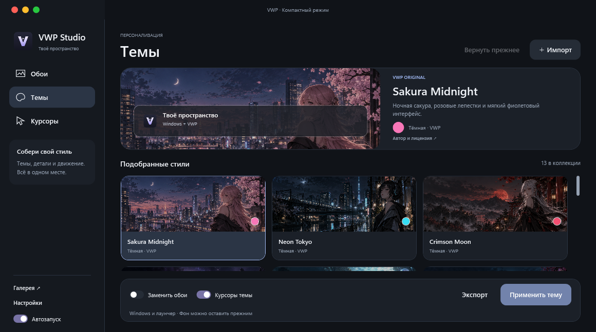
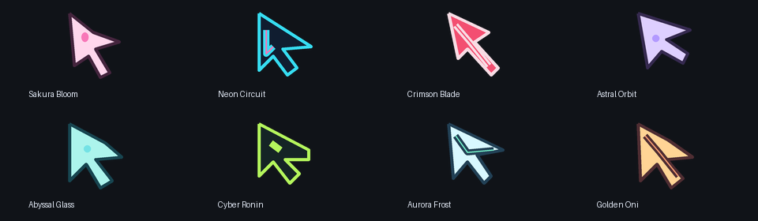
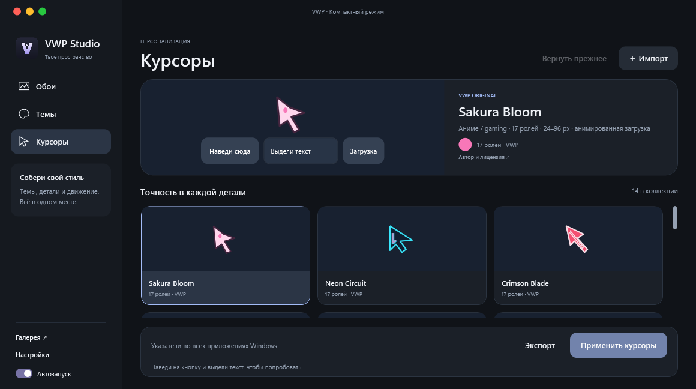
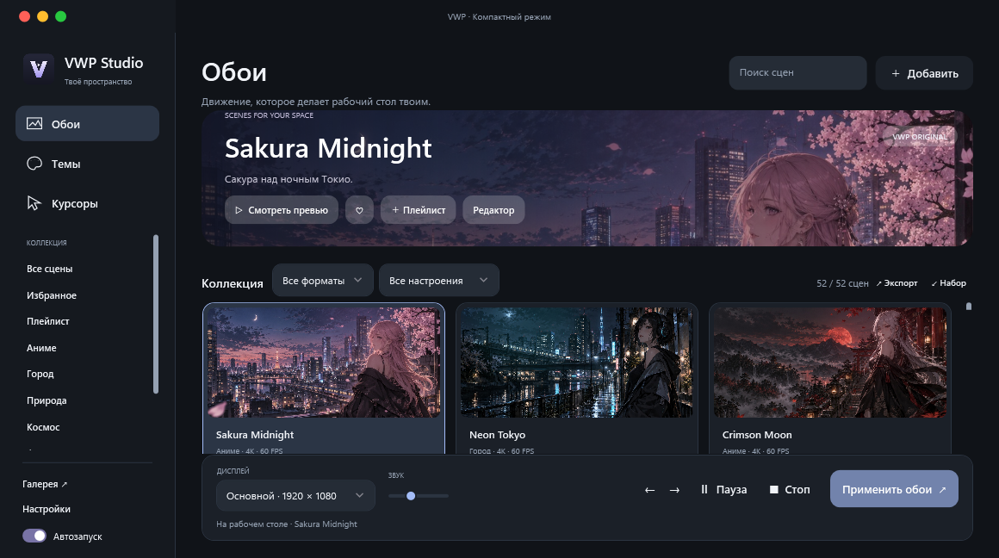

# VWP Studio — живые обои, темы и курсоры для Windows

[Скачать установщик или portable](https://github.com/domovoyproj/VWP/releases/latest) · **0.6.0** · Windows 10/11 x64 · C# / .NET 8 / WPF / LibVLC



## Что нового в 0.6.0

- Отдельные разделы «Обои», «Темы» и «Курсоры», спокойная тёмная палитра, светлый режим, адаптивный баннер и крупные карточки с настоящими превью.
- 13 готовых тем: восемь под первые аниме-обои и пять спокойных стилей — Obsidian, Glacier, Pearl, Catppuccin Mocha и Nord Frost. Тема меняет режим Windows, акцент, оформление VWP и, по выбору, курсоры и фон.
- 14 комплектов указателей: восемь собственных игровых наборов, а также VWP Pearl, VWP Obsidian, VWP Rose, Bibata Modern Ice, Bibata Modern Classic и Capitaine Dark. В каждом 17 ролей и анимированные указатели загрузки. Собственные курсоры имеют размеры 24–96 px, Bibata — 32–128 px.
- Удалены 15 процедурных видеообоев, включая Jellyfish Waltz. Обновление удаляет их файлы и заменяет прежние назначения на Sakura Midnight; личные видео остаются в библиотеке.
- В превью «Баланс» и «Экономия» больше не подменяют детализированный фон простой геометрией.
- При смене обоев отключены служебные надписи VLC: путь временного снимка, название файла и миниатюра снимка.

## Персонализация

| Тема под обои | Парные курсоры | Стиль |
|---|---|---|
| Sakura Midnight | Sakura Bloom | Лепестки и розовые акценты |
| Neon Tokyo | Neon Circuit | Двухцветный неон и технологичный прицел |
| Crimson Moon | Crimson Blade | Клинок и красный свет |
| Astral Drift | Astral Orbit | Комета и вращающаяся орбита |
| Ocean Sonata | Abyssal Glass | Бирюза и пузырьки |
| Skyline Racer | Cyber Ronin | Сегментированный прицел и кислотный акцент |
| Aurora Voyage | Aurora Frost | Ледяные грани и снежинка |
| Ember Ronin | Golden Oni | Золото, боевой указатель и искры |

Каждая тема сочетает иллюстрацию из оригинальной коллекции, палитру лаунчера, акцент Windows и отдельный комплект курсоров. Фон темы статичен; живые обои можно сохранить при применении.

В разделе **«Темы»** выберите стиль и нажмите «Применить тему». По умолчанию живые обои продолжают работать. Переключатель «Заменить обои» остановит их и установит статичный фон темы. «Курсоры темы» можно отключить. «Вернуть прежнее» восстанавливает настройки, сохранённые перед первым применением; при замене фона возвращаются прежние назначения живых обоев.

Темы применяют стандартные параметры Windows: светлый/тёмный режим, цвет акцента, фон и курсоры. Они не устанавливают сторонние `.msstyles` и не патчат системные файлы. Импортируются файлы **`.theme`** с локальными изображениями и указателями; экспорт создаёт `.theme` и папку `.assets`, которые нужно переносить вместе. Архивы `.themepack` и `.deskthemepack` пока не поддерживаются.

В разделе **«Курсоры»** наведите указатель на кнопку и выделите текст в поле предпросмотра. Это показывает реальные нативные курсоры выбранного набора. «Применить курсоры» меняет их во всей Windows. Поддерживается импорт `.cur`, `.ani` и ZIP-наборов; экспорт сохраняет ZIP с лицензией и включёнными исходниками. Установочные INF/BAT-файлы не выполняются.





## Обои

Встроенная библиотека содержит **46 предустановок**: 18 исходных видео, 18 вариантов живых сцен и 10 дополнительных анимированных сцен. Первые две группы используют общие исходные видео на рабочем столе; это не 46 уникальных видеороликов. Все встроенные видео воспроизводятся через LibVLC, под иконками рабочего стола. Постер выбранной сцены остаётся под плеером на стыке видеопетли и при Alt+Tab/Peek; при остановке и выходе возвращаются обычные обои Windows.

Мастер-видео имеют **3840×2160 / 60 FPS**. Исходные иллюстрации около 1672×941 масштабируются при рендере: это не нативные 4K-рисунки. Движение создаётся из слоёв, локальных деформаций, объектов, света и частиц. Они не являются полноценной генеративной анимацией персонажей. В Alpine Express поезд едет по мосту. Превью и миниатюры облегчены для лаунчера.

Профиль «Качество» воспроизводит мастер; «Баланс» создаёт копию до 1080p / 30 FPS, «Экономия» — до 720p / 15 FPS. При первом применении облегчённого профиля требуется время на подготовку. Частота воспроизведения зависит от устройства.



- Импорт видео, поиск, категории, избранное, плейлисты, расписание смены, отдельные назначения для мониторов, громкость и кадрирование.
- Автопауза при полноэкранном приложении, работе от батареи, блокировке и сне. Ручная пауза сохраняется при автоматическом возобновлении.
- Редактор видео: фрагмент, скорость, яркость, контраст, насыщенность, соединение стыка и экспорт отдельного файла.
- Наборы `.vwpbundle`, публичная онлайн-галерея с проверкой SHA-256, мини-панель в трее, проверка обновлений GitHub.
- Красный круг завершает приложение; жёлтый скрывает его в трей; зелёный переключает компактный и полноэкранный режимы. Alt+F4 скрывает окно, Esc возвращает компактный режим.

## Бесплатные наборы и лицензии

Собственные курсоры VWP распространяются под CC0. Их воспроизводимый генератор — [tools/make_cursors.py](tools/make_cursors.py). Три оригинальных фона созданы для проекта; описание промптов и исходного разрешения — [assets/themes/ARTWORK.md](assets/themes/ARTWORK.md).

| Набор | Источник | Лицензия |
|---|---|---|
| Bibata Modern Ice / Classic | [ful1e5/Bibata_Cursor v2.0.7](https://github.com/ful1e5/Bibata_Cursor/tree/v2.0.7) | GPL-3.0 |
| Capitaine Dark Windows HiDPI | [hervad/capitaine-cursors-w11-hidpi v3.1.0](https://github.com/hervad/capitaine-cursors-w11-hidpi/tree/v3.1.0) | LGPL-3.0-or-later |
| Catppuccin Mocha palette | [catppuccin/palette](https://github.com/catppuccin/palette) | MIT |
| Nord palette | [nordtheme/nord](https://github.com/nordtheme/nord) | MIT |

Catppuccin и Nord — адаптации палитр в VWP, не официальные порты тем Windows. Их фоновые изображения относятся к VWP. Лицензии включены в `licenses/`; лицензии курсоров и архивы соответствующих исходников — в папках наборов. [tools/vendor_cursors.py](tools/vendor_cursors.py) загружает фиксированные версии как данные.

## Данные и обновления

Установка обновления сохраняет `%LOCALAPPDATA%/VWP/`: настройки, импортированные видео, избранное, очереди и локальные наборы персонализации. `personalization/` содержит копии применённых курсоров, импортированные темы и журналы возврата прежних настроек. Курсоры копируются сюда до применения, поэтому работают после закрытия или переноса portable VWP.

В настройках можно скачать следующий официальный релиз. Перед запуском установщика проверяется SHA-256. Portable-версия предлагает обычную установку. Установщик текущего пользователя не требует прав администратора; приложение не подписано цифровой подписью.

## Сборка и проверка

Нужны .NET 8 SDK и Python 3.12. Для полной дистрибуции требуются все исходные медиа: 18 мастер-видео и превью находятся в `assets/`, 10 дополнительных MP4 не хранятся в Git. Для 0.6.0 используются неизменённые мастеры из проверенного официального релиза 0.5.2.

```powershell
python -m pip install Pillow imageio-ffmpeg==0.6.0
python tools/bootstrap_ffmpeg.py
python tools/fetch_cinematic.py
# Для изменения анимации: dotnet run --project tools/cinematic-render/cinematic-render.csproj -c Release -- 18
python tools/check_expansion.py
python tools/check_cinematic.py
python tools/check_personalization.py
dotnet build VWP.csproj -c Release
powershell -ExecutionPolicy Bypass -File build.ps1 -Installer
python tools/package_release.py --version 0.6.0 --build dist/Release-0.6.0
```

Для установщика нужен Inno Setup 6. Workflow **VWP Studio release** получает 10 неизменённых мастер-видео из официального 0.5.2 с проверкой SHA-256, проверяет коллекцию и курсоры, собирает установщик и portable. После публикации тега `v0.6.0` создаёт официальный GitHub Release.

Нативная проверка `VWP.dll --verify-personalization` проверяет загрузку всех 238 курсоров Windows, применение/возврат, импорт/экспорт и миграцию удалённых сцен; снимки лаунчера сохраняются в `verification/`. Она временно меняет оформление текущего сеанса и затем восстанавливает его. `--verify`, `--verify-ui` проверяют воспроизведение, паузу, трей, режимы окна и превью. `tools/live-check --cinematic-check` проверяет изменение видимых пикселей всех 28 анимированных сцен и сохранение изображения в разных профилях.

## Архитектура

`MainWindow` управляет библиотекой и назначениями дисплеев; `DesktopHost` встраивает VLC в WorkerW и поддерживает постер при перезапуске видеопетли. `AppearanceCatalog`, `WindowsAppearanceService` и `CursorPackService` отвечают за персонализацию; `AppearancePanel` — за её интерфейс. `PersonalizationBackup` сохраняет прежние значения реестра и восстанавливает их. Исходники прежних диорам остаются для разработки; их миниатюры и процедурные видеопакеты не входят в установку.

Граф кодовой базы строится локально и исключён из Git:

```powershell
.venv/Scripts/python.exe -m pip install graphifyy
.venv/Scripts/graphify.exe extract . --code-only
.venv/Scripts/graphify.exe query "DesktopHost scene transitions"
.venv/Scripts/graphify.exe affected "DesktopHost"
.venv/Scripts/graphify.exe god-nodes
.venv/Scripts/graphify.exe explain "CursorPackService"
.venv/Scripts/graphify.exe update .
```

Лицензия приложения — MIT. Отдельные сторонние наборы и библиотеки сохраняют свои лицензии, включённые в дистрибуцию.
