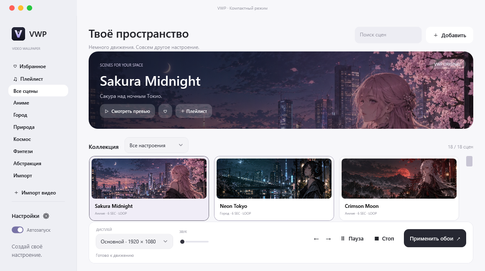
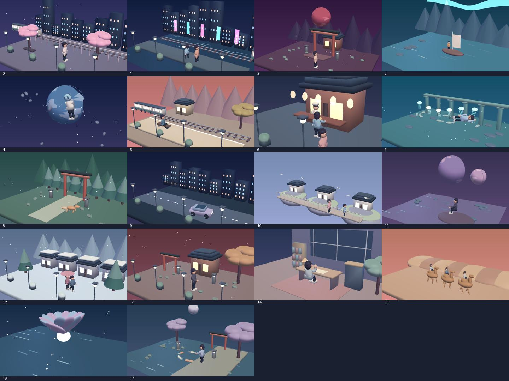
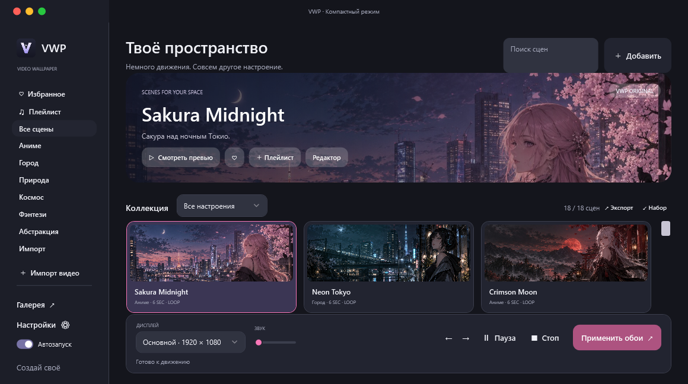
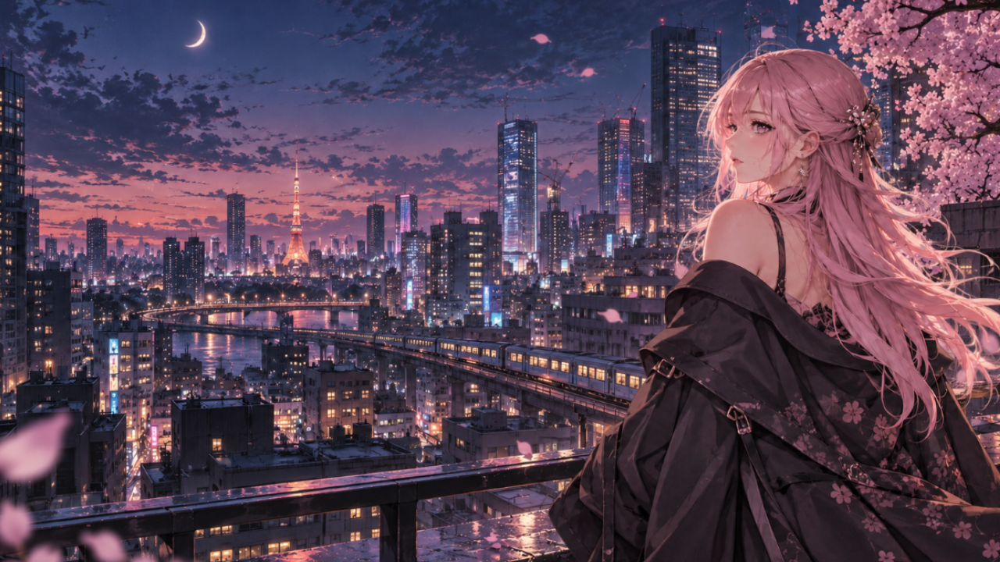
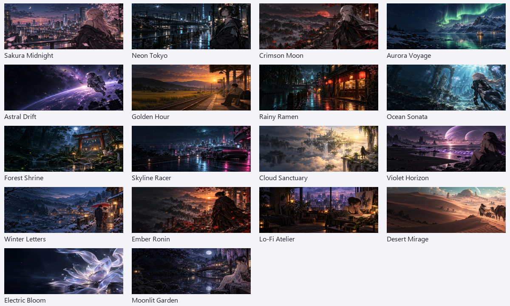

# VWP — живые обои для Windows

[Скачать установщик или portable-архив](https://github.com/domovoyproj/VWP/releases/latest). Версия 0.5.2: C# / .NET 8 / WPF / LibVLC, 33 видеообоя и 28 живых сцен.

## Коллекция 0.5.0

Версия **0.5.2** устраняет краткое появление обычных обоев Windows на стыке видеопетли: под окном VLC постоянно находится постер выбранной сцены. Видео продолжает двигаться, а при его перезапуске рабочий стол сохраняет изображение той же сцены.

В версии **0.5.1** все 28 живых сцен воспроизводятся через видеослой VLC на рабочем столе Windows. Это исправляет ситуацию, когда прежний WPF-слой с 3D-анимацией оставался невидимым за иконками Explorer и показывалась только статичная подложка. Для 18 прежних сцен используются их исходные MP4; ещё 10 получили новые детализированные фоны и отдельные видео с движением людей, транспорта и предметов. В Alpine Express поезд едет по мосту. Новые видео поставляются в 3840×2160 и 60 FPS, 12 секунд на цикл. Исходные иллюстрации имеют около 1672×941 пикселя и масштабируются при рендере; это не нативные 4K-рисунки. «Баланс» и «Экономия» воспроизводят облегчённые копии тех же видео. Статичная резервная подложка теперь готовится не ниже разрешения исходной иллюстрации.

Версия 0.5.0 добавляет 10 новых 3D-диорам и 15 процедурных видеоциклов: дождь, сияние, море, огонь, полёт среди звёзд, кои, метеоры, светлячки, неоновая трасса, лава, снег, сакура, воздушные шары, орбиты и медузы. Итого 61 встроенная сцена: 28 в 3D и 33 видео.

Workflow **Cloud wallpaper collection** рендерит новые видео в GitHub Actions: 3840×2160, 60 FPS, 12 секунд. Это нативная отрисовка в указанном разрешении. Проверяются все 720 декодированных кадров, отсутствие соседних дублей, периодичность исходной анимации и SHA-256. После всех проверок собираются установщик и portable. При публикации тега файлы загружаются в постоянный раздел [Releases](https://github.com/domovoyproj/VWP/releases).

Новые MP4 создаются из `tools/render_motion.py`, не хранятся в Git. Для локальной сборки сначала выполните этот скрипт с `--id 100` … `--id 114` и `dotnet run --project tools/scene-check/scene-check.csproj -- assets/spatial`. Проверка полноты: `python tools/check_expansion.py`. Установка новой версии сохраняет прежнюю библиотеку и настройки.

## Качество встроенных обоев

В версии **0.4.0** все 18 тем получили отдельные **стилизованные 3D-диорамы**. Это заново построенные объёмные сцены: персонажи двигают руками и ногами, поезд прибывает на станцию, повар подаёт миску, художник рисует и поднимает чашку, верблюды идут, планеты вращаются. Геометрия и анимация рассчитываются локально; подписки и интернет не нужны.

В версии **0.4.1** библиотека содержит **36 предустановок: 18 исходных видео и 18 отдельных 3D-сцен**. Они доступны одновременно; фильтр «Видео / 3D» помогает выбрать нужный тип. 3D-сцены отмечены в названии и не зависят от переключателя анимации импортированных наборов. Исходные аниме-иллюстрации не превратились в реалистичное видео: у нового набора другой, простой объёмный стиль.

Исходные 3D-диорамы остаются в коде для превью и разработки, но на рабочем столе версии 0.5.1 их заменяют видео: 3D-слой не отображался на проверенной сборке Windows 11. Ручная и автоматическая пауза останавливают воспроизведение. Параллакс, музыкальные эффекты и кадрирование исходного изображения относятся к режиму слоёв, а не к видео обоев.

Все 18 видеосцен пересобраны в **3840×2160, 60 FPS**: каждый шестисекундный цикл содержит 360 отдельных кадров движения. Исходные иллюстрации имеют размер 1672×941 и масштабируются в 4K; это не нативные 4K-рисунки. Камера, локальные деформации, свет и частицы отрисовываются заново для каждого кадра, а не дублируются из старых 24 FPS видео.

Для полного разрешения выберите **Настройки → Производительность → Качество**. Этот профиль включён по умолчанию для новых настроек. Существующие настройки профилей сохраняются. «Баланс» создаёт копию до 1080p / 30 FPS, «Экономия» — до 720p / 15 FPS. Частота реального воспроизведения зависит от устройства.

Для подложки рабочего стола используются отдельные 4K-постеры. Они также служат фоном интерактивных сцен, кроме Sakura Midnight с её отдельными слоями. Миниатюры библиотеки остаются небольшими для экономии памяти. Баннер, карточки и исходное превью редактора используют отдельные 720p/30 видео; на рабочем столе в профиле «Качество» воспроизводится 4K/60. Экспорт редактора выполняется в профиле 2160p/60, без увеличения разрешения меньших исходников.

## Возможности

- Интерактивные сцены: курсор управляет глубиной; фон, персонаж и частицы рендерятся независимо. Sakura Midnight имеет отдельный прозрачный слой героини и чистый фон. Для остальных сцен используются фон и эффекты; свой PNG персонажа добавляется в настройках.
- Реакция на музыку: WASAPI измеряет звук устройства вывода; свет и частицы реагируют на амплитуду. Микрофон не используется, аудиофайлы не записываются. Функция работает в интерактивном режиме.
- Редактор: фрагмент по времени, скорость ×0.25–3, яркость, контраст, насыщенность и соединение конца с началом цикла. Результат сохраняется отдельным видео с новым превью. Аудиодорожка сохраняется со скоростью и затуханием на стыке.
- Светлая, тёмная и системная темы, цветовой акцент сцены и собственные округлые поля ввода.
- Один клик по иконке трея открывает мини-панель: дисплей, сцена, пауза, очередь и звук. Двойной клик открывает лаунчер.
- Профили: Экономия — 15 FPS и до 720p; Баланс — до 30 FPS и 1080p; Качество — исходное видео и до 60 FPS интерактивных эффектов. Для видео ограничение обеспечивается локальной копией; первый запуск может занять время. Исходник сохраняется. Для интерактивного фона ограничиваются частота и размер текстур. В настройках показаны CPU/RAM самого VWP и исключения автопаузы по именам EXE.
- Онлайн-галерея: поиск, категории, фильтр автора, профиль GitHub, загрузка и SHA-256. Каталог находится в публичном GitHub-репозитории; свой HTTPS-каталог задаётся в настройках. Публикация создаёт релиз с набором и обновляет каталог в собственном публичном репозитории. Нужен токен пользователя с Contents: write. Токен используется в памяти и очищается после операции.
- Наборы `.vwpbundle`: экспорт сцены или плейлиста с видео, изображениями, слоями и настройками. Импорт добавляет сцены; настройки выбранного дисплея применяются отдельной кнопкой. Проверяются контрольные суммы, пути, формат и размеры. Набор можно перетащить в лаунчер.

## Установка

Запустите `VWP-0.5.1-Setup.exe`. Установка для текущего пользователя, без прав администратора, с ярлыком в меню «Пуск» и удалением через параметры Windows. Библиотека и настройки хранятся отдельно от приложения, поэтому сохраняются при обновлении и удалении.

Portable: распакуйте `VWP-0.5.1-win-x64.zip` целиком и запустите `VWP/VWP.exe`. .NET, Python и VLC устанавливать не нужно. Установщик приложения пока не имеет цифровой подписи.

## Использование

1. Выберите дисплей в нижней панели. Его сцена, звук, кадрирование и плейлист независимы от остальных мониторов.
2. Выберите сцену и нажмите «Применить обои». Кнопка ♡ добавляет сцену в избранное, «＋ Плейлист» — в очередь выбранного дисплея. Повторное нажатие убирает сцену.
3. В «Настройках» выберите заполнение экрана или вписывание целиком и настройте положение кадра. Превью показывает текущую сцену дисплея, а до применения — выбранную сцену.
4. Для автоматической смены включите «Менять сцены», задайте интервал, порядок и время. Одинаковое время начала и конца означает весь день; поддерживается интервал через полночь. Расписание ограничивает смену сцен, текущая сцена вне интервала продолжает воспроизводиться. Стрелки внизу переключают очередь вручную. В настройках можно переставлять и убирать сцены.
5. Перетащите видео в окно или нажмите «Добавить». Новые импорты копируются в библиотеку VWP, исходный файл можно перенести. Импорты из 0.1.0 сохраняют прежние пути.

Автопауза срабатывает при полноэкранном приложении на соответствующем мониторе, питании от батареи, блокировке сеанса и переходе в сон. После снятия причины видео продолжится, если вы сами не поставили его на паузу. Пауза именно останавливает декодирование видео, сохраняя изображение на рабочем столе. Детектор учитывает размер активного окна, поэтому работает и с полноэкранными браузером или плеером. На батарее останавливаются все дисплеи.

Наведение на карточку запускает тихое превью с задержкой; функция отключается в настройках. Превью в баннере запускается кнопкой. Есть поиск, категории, избранное и подборки «Ночной Токио», «Спокойствие», «Космос», «Работа». При смене сцены VWP пытается получить последний кадр и плавно проявить новое видео поверх него; если снимок недоступен, применяется обычное переключение.

Круглые кнопки: красная завершает VWP и возвращает обычные обои; жёлтая сворачивает в трей; зелёная переключает полноэкранный и компактный режимы. Esc возвращает компактный режим. Alt+F4 сворачивает в трей. Верхняя панель позволяет перетаскивать окно, края — менять размер. Автозапуск восстанавливает сцены всех подключённых дисплеев и скрывает лаунчер.

При Alt+Tab/Peek под видео находится подходящая картинка сцены. При остановке или выходе возвращается прежняя картинка. Если пользователь сменил её самостоятельно, VWP сохраняет этот выбор. После замены слоя Explorer приложение восстанавливает видео автоматически. После изменения мониторов повторно применяются сохранённые назначения.

## Обновления и данные

В настройках можно проверить релизы GitHub и скачать установщик следующей версии. Перед запуском проверяется SHA-256 из данных релиза. Автоматическая проверка при старте отключается; установка запускается только кнопкой пользователя. Portable-версия при обновлении предлагает установить приложение в обычную папку; установленная версия обновляет свою папку.

Данные: `%LOCALAPPDATA%/VWP/`. `settings.json` содержит настройки, избранное и очереди; `library/` — скопированные видео; `covers/` и `snapshots/` — подложки; `desktop-backup*.json` — журналы возврата обычных обоев отдельно для каждого дисплея. Настройки 0.1.0 автоматически мигрируют; встроенные сцены сохраняются по ID, независимо от расположения EXE.

## Сцены

Sakura Midnight, Neon Tokyo, Crimson Moon и ещё 15 оригинальных шестисекундных циклов. В 0.3.0 к дождю, снегу, искрам, пузырькам и светлячкам добавлены движение камеры, лёгкий параллакс, мягкое изменение света и локальное покачивание волос, ткани, листвы или кристаллов. Это обработка AI-иллюстраций с небольшими деформациями; полноценной персонажной анимации и нарезок сериалов здесь нет. Свои аниме-эдиты можно импортировать.

Каталог: `assets/presets.json`. Исходники и промпты: `assets/ARTWORK.md` и `assets/NEW_ARTWORK.md`. Python нужен только разработчику для ассетов: `pip install -r tools/requirements-media.txt`, затем `python tools/make_presets.py --jobs 2`. При наличии Intel Quick Sync можно добавить `--encoder h264_qsv`; по умолчанию используется программный libx264. Генератор записывает готовый файл только после успешного кодирования.

## Сборка и проверка

Установите .NET 8 SDK. `dotnet run --project VWP.csproj` запускает исходники. `powershell -ExecutionPolicy Bypass -File build.ps1` собирает автономный EXE в `dist/Release-0.5.2`. Для установщика нужен Inno Setup 6: `build.ps1 -Installer -Compiler "путь/ISCC.exe"`.

`python tools/verify_presets.py` полностью декодирует 18 видео, проверяет изображения, бесшовность эффектов и размеры ICO. `python tools/package_release.py` создаёт portable-архив, проверяет CRC и пишет SHA-256. Лицензии поставляемых библиотек включены в `licenses/`.

Закройте обычный VWP перед диагностикой. `VWP.exe --verify` проверяет циклическое воспроизведение шести сцен, паузу, подложки и возврат обычных обоев, положения окна, режимы и трей. `--verify-features` проверяет расписание через полночь, очередь и shuffle, фильтр избранного, реальную автопаузу/продолжение, переключение по таймеру, кадрирование и разбор обновлений. Для проверки вертикального видео положите клип `portrait.mp4` в подпапку `verification/`. `--verify-ui` проверяет встроенное превью. Рендеры и отчёты создаются в `verification/` рядом с EXE; настройки пользователя в этих режимах не записываются. Тесты кратковременно изменяют рабочий стол и возвращают обои при завершении.

При пуше тега `v*` GitHub Actions собирает portable и установщик, проверяет ассеты и публикует файлы. Версия тега должна совпадать с `VWP.csproj`.

## Совместимость

Windows 10/11 x64 с Explorer. WorkerW — недокументированный слой оболочки, поэтому совместимость со всеми сборками Windows не гарантируется. Превью использует Windows MediaElement и поддерживает меньше кодеков, чем VLC в обоях. Встроенные сцены: 3840×2160 / 60 FPS, H.264, BT.709. Workshop пока не подключён.

В локальной проверке был доступен один физический монитор; поведение на двух дисплеях с разным DPI требует отдельной аппаратной проверки. Цифровая подпись приложения и установщика пока не настроена. Не храните токены и секреты в репозитории.

## Graphify

Граф создаётся локально: `.venv/Scripts/python.exe -m pip install graphifyy`, затем `.venv/Scripts/graphify.exe extract . --code-only`. `graphify-out/` исключён из Git. Правила находятся в AGENTS.md: перед анализом архитектуры и связей использовать `query`, `affected`, `god-nodes`, `explain`; после правок выполнять `graphify update .`.

Примеры: `graphify query "DesktopHost InteractiveVisual AudioReaction"`, `graphify affected DesktopHost`, `graphify god-nodes --top 5`, `graphify explain BundleService`.

`VWP.exe --verify-studio` проверяет темы, поверхность интерактивного рабочего стола, паузу рендеринга, системный звук, мини-панель, обработку видео с аудио, импорт/экспорт наборов, защиту от повреждения и выхода за папку, фильтры галереи. Результаты и рендеры находятся в verification/.

Для сборки редактора установите `imageio-ffmpeg==0.6.0` и выполните `python tools/bootstrap_ffmpeg.py`: бинарник FFmpeg проверяется по фиксированному SHA-256 и включается в пакет. Он не хранится в Git. Лицензии и источники FFmpeg/NAudio перечислены в licenses/.
